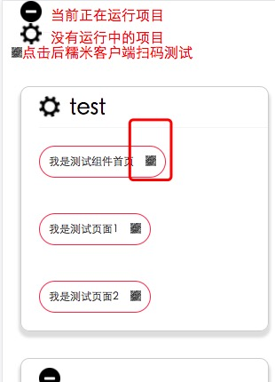

本项目基于webpack构建  命令行如下：

#### 安装依赖
[yarn or npm命令对比](http://www.wemlion.com/2016/npm-vs-yarn-cheat-sheet/)
	
	1、npm i -g webpack 
	   npm i -g yarn && yarn && yarn global add webpack
	
	2、yarn or npm i

#### 创建糯米组件

	npm run project --module=组件名称

#### 创建Page页面

	npm run create --module=项目名称 --page=页面名称 --filedesc=描述 [--w=page/widget]

	最后一个参数指定 是新建page页面or widget块[默认page]

#### 开发
	npm run dev --module=模块名称

#### rd开发机测试

	npm run rd --module=模块名称

#### 发布版本

	npm run release --module=模块名称 [--e=dev|qa|pro]

	默认值pro

#### 性能报告
    npm run performance --module=组件名称

#### 发布上线版本包[待改造]

	npm publish  --module=组件名称 --version=x.x.x [--filedesc描述]

####相关文章

[构建工具](./docs/构建工具版本更新情况.md)

[QA文档](./docs/QA.md)

[项目目录](./docs/项目目录结构.md)

##调试工具(vconsole)和BNJS注入情况说明
打开BNJS支持需要在加入参数need_bnjs=1

| 命令        |  调试工具        | BNJS |
| ------------- |:-------------:| -----:|
| npm run dev |  注入| 注入 |
| npm run performance| 注入   | 注入  |
| npm run rd | 注入    |   注入 |
| npm run release |--e=pro 不注入;其他情况注入|   不注入 |
| npm run create | 不注入    |   不注入 |
| npm run project | 不注入    |   不注入 |
| npm run help | 不注入    |   不注入 |

####发包环境指定情况(确切的说--e只给发release包用)

| 命令        |  参数--e        |
| ------------- |:-------------:|
| npm run dev |  无效 |
| npm run performance|无效|
| npm run rd | 无效   |
| npm run release | 有效[dev\pro\qa] |

####如何开启监听者和页面参数自动补全

config.js

	audient:true

	具体页面参数写法
	//@params xxxkey=xxxvalue
	页面调试时参数自动补全

####开发阶段如何切换请求地址

config.js

		proxy: {
        host: '0.0.0.0',
        proxy: [{
            context: ['/bnnserver'],
            target: '开发环境指向域名',
            headers: {
                Host: 'bnhbp.nuomi.com',
                'Access-Control-Allow-Origin': '*'
            },
            secure: false
        }]
    }

####如何本地mock数据

 根目录 config.js注释掉proxy相关的选项

 然后在在output下添加请求的file地址

 	例如:localhost/xxxserver/first.json

	对应在新建output/xxxserver/first.json

#### 如何开启手机扫码调试

	1、本地安装web-server

	2、将webserver的根目录指向项目的output 文件夹

	3、点击

	4、手机扫码二维码

####如果不想将webserver的documentroot指定到output下（例如我项目跟还有很多其他项目）怎么办？
	答：
	手段1：
	上边只是最快捷的方式，你可以在当前项目跟下更改webserverRoot(默认:'')
	例如
	（类Unix系统）你的webserver跟路径是/Users/memoryza/nuomi,而当前项目路径是/Users/memoryza/nuomi/channel(项目名称)
	
	（windows）你的webserver跟路径是d:/work,而当前项目路径是d:/work/channel
	
	
	这时候可以将webserverRoot: /channel/output
	
	
	指定的路径是浏览器的路径符号(/)跟操作系统无关
	
	这里是一次性操作，请不要反复如果需要反复更改，则删除output/audient目录
	
	手段2：
		npm install -g http-server
		
		然后在output下 http-server -p 80
		然后扫码访问

####如何处理跨域请求
	1、config.js
	 	可以进行api的配置进行跨域处理(如何配置:https://github.com/chimurai/http-proxy-middleware)
	2、chrome安装扩展程序 Allow-Control-Allow-Origin，所有请求都可以跨域
	
####组件命名建议
垂类_组件名

例如:edu_xxxx

如果是通用组件

common_组件名

####如何发布到rd开发机器
首先发布到rd机器依赖于fis3的功能，所以您需要安装fis3

然后将[receiver.php](https://github.com/fex-team/fis3-deploy-http-push/blob/master/receiver.php) 放到开发机器odp指定的webroot目录下

最后运行npm run rd --module=xxx

